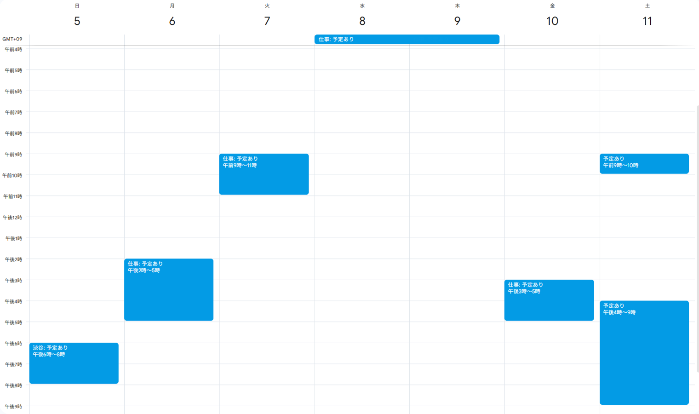

## 開発の背景
みなさん，Googleカレンダーの共有機能使ってますか？よく日程調整する仕事相手や友人，家族にカレンダーを共有しておけばスムーズに日程調整ができて便利ですよね．予定の内容を知られたくなくても，共有相手には"予定あり"とだけ表示することもできるので安心です．

自分はこの機能使ってなかったんですが，最近予定が詰まるようになってきてミーティングや飲み会の日程調整をするのがめんどくさくなってきたので，噂には聞いていたこの機能を試してみることにしました...がデフォルトの機能だけでは複数のカレンダーを一つにまとめて共有することができないことに気づいて絶望しました．

自分の場合は大学，バイト，インターン，プライベート，その他所属する組織...と複数のカレンダーを日頃から使い分けているんですが，それぞれのカレンダーをすべて共有するのはめんどくさいです．一応解決策としてそれぞれのカレンダーの予定ファイルを取得して一つのカレンダーにインポートする方法があるんですが，単純にめんどくさいのと，インポートした時点での予定しか共有できないので，リアルタイムに更新されないのが致命的です．

そこで，Google Apps Script（以下GAS）を使って複数のカレンダーを一つにまとめて共有するプログラムを作りました．

### 独自性？
ちなみにここまでの機能だけであれば，ZapierやIFTTTなどのノーコードツールを使って実現することもできますし，かなり前に開発されたもののようですが，似たようなGASのコードもGitHub上で公開されています．
ただノーコードツールはあんまり使ってことなくて自信なかったのと，GitHub上で公開されているコードはかなり昔に開発されたもので自分で1から作ったほうがメンテナンス性も良さそうだったので，今回は自分で一から作りました．それによってオリジナルでいくつか機能追加できたので結果的には良かった？かなと思います

実は最初はバイブコーディングのお試しがてら自分で使う物を作ろうと思ったのが始まりで，公開するつもりはなかったんですが，前述の通り意外と先例がなかったので公開することにしました．1時間くらいで適当に作ったので適当な部分は許してください．（むしろこのブログ書く方が時間かかったので若干後悔）


## 主な機能と特徴
このツールは，複数のGoogleカレンダーに散らばった予定を，指定した一つのカレンダーに自動で集約・同期するためのものです.Googleスプレッドシートを簡単な設定画面として利用し，専門的な知識がなくても使えるように設計されています.
- **カレンダーの集約**

  複数のカレンダー（仕事用，プライベート用など）の予定を，内容（タイトル，日時情報以外のすべて）を隠した状態で一つのカレンダーにまとめることができます．（1ヶ月前から半年先まで）

- **必要な情報を残す**

  予定の詳細は隠したいが，どこにいるかだけは伝えたい，仕事なのかプライベートなのかは伝えたいといったときに，適切にタイトルを設定すれば共有カレンダー内にその情報を残すことができます．

- **柔軟なタイトル変換**

  予定のタイトルの先頭に特定のキーワードがある場合，そのキーワードを別に指定したタグに置き換えることができます．例えば「work-」というキーワードから始まる予定を「仕事:」と置き換えることにしておけば「work-ミーティング」，「work-商談」などの予定をすべて「仕事:予定あり」として共有カレンダーに表示できます．
  （Tags for Google CalendarというChrome拡張機能を使うと，Googleカレンダー上で予定のタイトルにタグを付けることができるので，それと組み合わせると便利です）

- **簡単な設定画面**

  同期するカレンダーの選択やルールの設定は，すべてスプレッドシート上で行うことができます．（コードを直接編集する必要はありません）

- **自動同期**

  GASの機能を利用して，自分が設定した間隔で定期的にカレンダーの同期を自動で行うことができます.

## 導入にあたっての注意
このツールを導入する前に，以下の点についてご理解・ご了承いただけますようお願いいたします.

### 免責事項
- このツールは個人が開発したものであり，Googleの公式製品ではありません.
- 開発にあたっては細心の注意を払っていますが，予期せぬ不具合やGoogleの仕様変更により，正常に動作しなくなる可能性があります.
- 万が一，このツールを利用したことによるデータの損失やその他の損害が発生した場合でも，開発者は一切の責任を負いかねます.
- 初めて利用する際は，念のため，なくなっても影響の少ないテスト用のカレンダーで動作を確認することをお勧めします.

### 必要な権限について
このツールを動作させるには，あなたのGoogleアカウントに対していくつかの権限を許可していただく必要があります.これは，スクリプトがあなたの代わりにカレンダーやスプレッドシートを操作するために不可欠なものです.

- Googleカレンダーの読み書き権限: 同期元のカレンダーから予定を読み取り，集約先のカレンダーに予定を作成・編集・削除するために必要です.
- Googleスプレッドシートの利用権限: このツール本体であるスプレッドシートを操作し，設定を読み取るために必要です.
- 外部サービスへの接続: 高機能版のGoogle Calendar APIを利用するために必要です.

## 導入手順
基本的にはGoogleアカウントさえ持っていれば以下の手順に従って進めていただければ簡単に導入できます！
(GASに詳しい方は，[GitHubリポジトリ](https://github.com/Syo-121/GoogleCalender_Integration/tree/main)から直接コピーしてアレンジしたりしながら使っていただいて大丈夫です！)

### 下準備
1. あらかじめGoogleカレンダー内で，予定が入ってないカレンダーを一つ作成しておいてください．これが集約先のカレンダーになります．
2. タイトル内に":"（コロン，半角）xが含まれていると，コロンの前までの文字列は集約先のカレンダー上に残ります．
    - 例: タイトルが「仕事:ミーティング」の場合，集約先のカレンダー上では「仕事:予定あり」と表示されます．
    - 活用例：「コロンの前に場所を入れて，見た人がだいたいどこに何時にいるのか分かるようにする」，「仕事，プライベートなどタグをつけて共有先の人が分かるように...」など
    - 逆に情報を何も載せたくない場合にはタイトル内にコロンを入れないようにしてください．

### スプレッドシートのコピー
テンプレートのスプレッドシートをご自身のGoogleドライブにコピーしていただきます．
[コード設定用のスプレッドシート](https://docs.google.com/spreadsheets/d/15HvHlaRqiP2V1QBvbt6aiO7gPOfK_9pi74EPbUVk9ew/copy)からアクセスし，「ドキュメントをコピー」という画面が表示されたら，「コピーを作成」ボタンをクリックします.

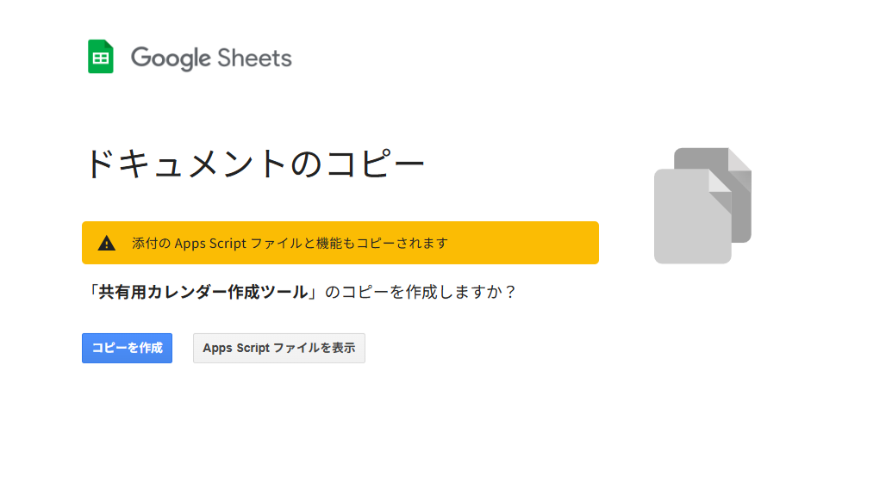

### カレンダーIDの取得
1. メニューバーに「カレンダー同期設定」という項目が追加されているので，それをクリックし，「設定を開く」を選択します.
2. 画面右側に設定用のサイドバーが開きます.
3. 初めての場合，権限の承認を求められますので，画面の指示に従って進めると以下のような画面が表示されます.
4. 上記の導入にあたっての注意を読んでいただき，同意して頂ける場合は詳細 > "共有用カレンダー作成(安全ではないページ)に移動"をクリックします.
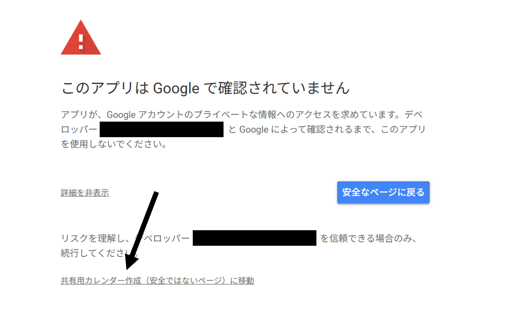
5. 表示された権限を許可してください．（許可しない場合，このツールは動作しません）
6. サイドバーが開き下のような画面が表示されます
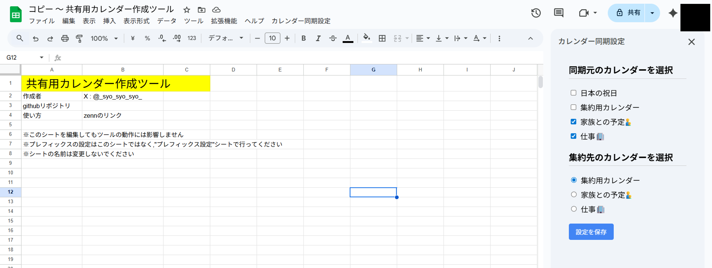
7. 「同期元のカレンダーを選択」で，集約したいカレンダーをすべてチェックします.
8. 「集約先のカレンダーを選択」で，まとめ先となるカレンダーを一つ選びます.
9.  「設定を保存」ボタンをクリックします.

### タイトル変換ルールの設定（任意）
先述したように予定のタイトルの先頭に特定のキーワードがある場合，そのキーワードを別に指定したタグに置き換えることができます．例えば「work-」というキーワードから始まる予定を「仕事:」と置き換えることにしておけば「work-ミーティング」，「work-商談」などの予定をすべて「仕事:予定あり」として共有カレンダーに表示できます．
（Tags for Google CalendarというChrome拡張機能を使うと，Googleカレンダー上で予定のタイトルにタグを付けることができるので，それと組み合わせると便利です）

1. スプレッドシートの下部から「タイトル変換ルール」シートを開きます.
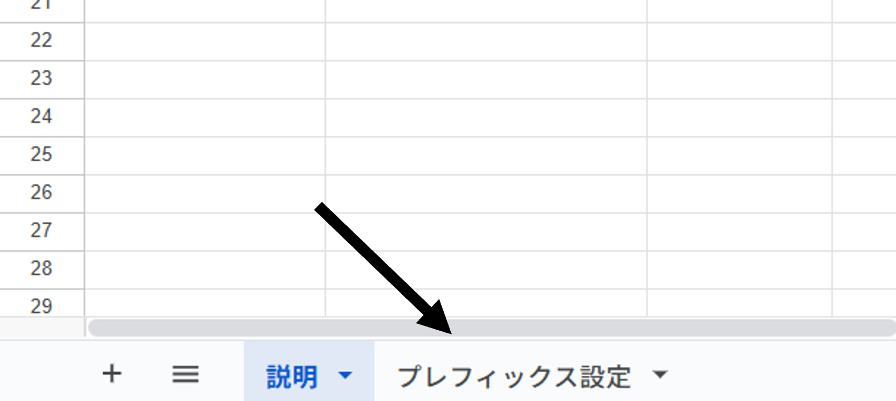
2. A列に変換前のキーワード，B列に変換後のタグを入力します.
   - 例: A列に「work-」，B列に「仕事:」と入力すればwork-で始まる予定がすべて「仕事:予定あり」として表示されます.
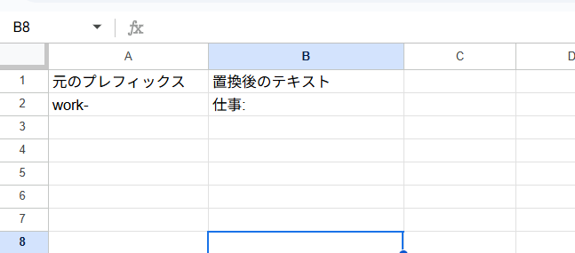
3. 複数のルールを追加する場合は，1行毎にA列とB列にそれぞれ入力してください.

### テスト実行
1. スプレッドシートのメニューから「拡張機能」>「Apps Script」を選択します.
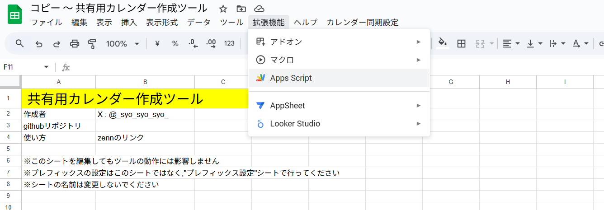
2. スクリプトエディタが新しいタブで開きます.
3. 上部の関数選択ドロップダウンから「syncAllCalendars」を選択します.
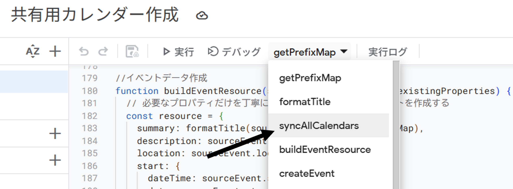
4. 「実行」ボタン（再生アイコン）をクリックします.
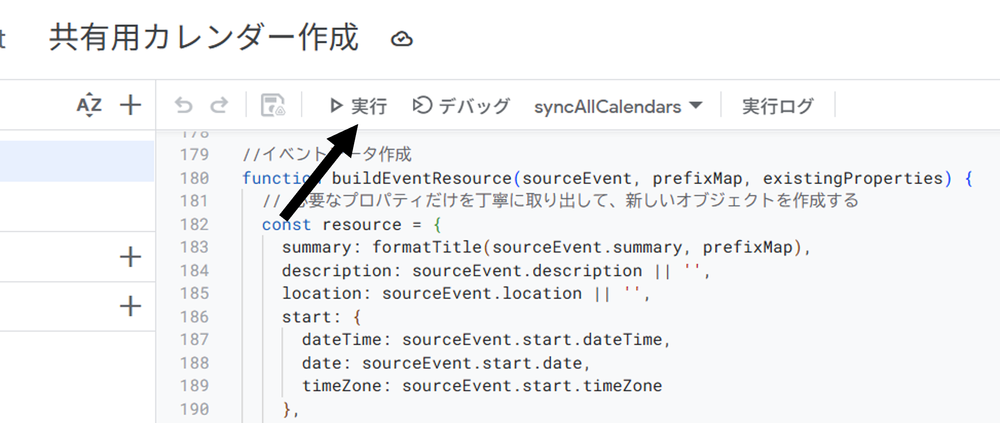
5. 初めて実行する場合，権限の承認を求められますので，画面の指示に従って許可してください.
6. 実行が完了したら，集約先のカレンダーを確認し，予定が正しく同期されているか確認してください.（初回の実行で，同期する予定数が多い場合，数分かかることがあります）
   
もともとこのような予定だったのが...（赤が仕事，青がプライベート）
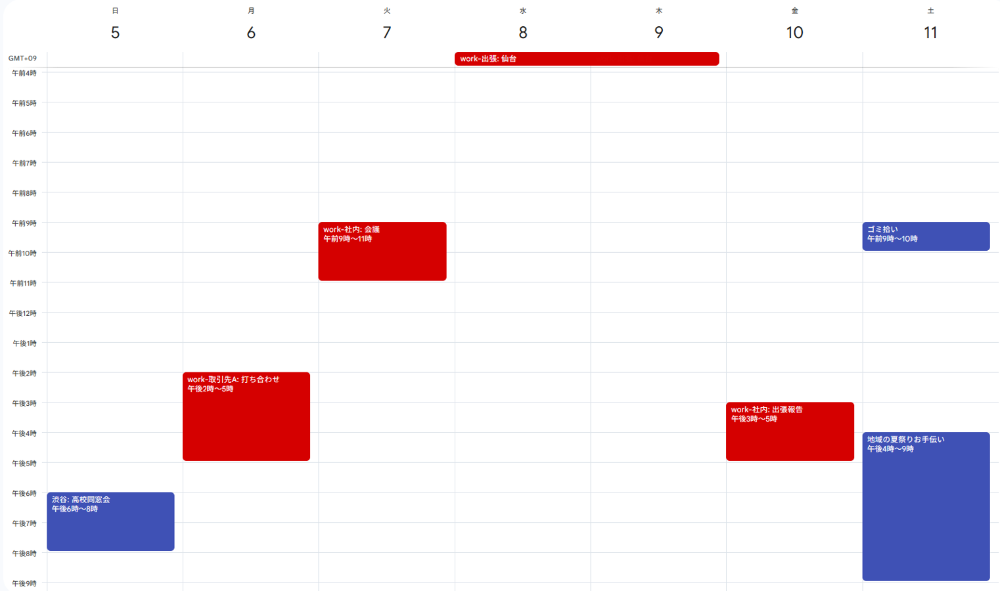

このように集約されます！
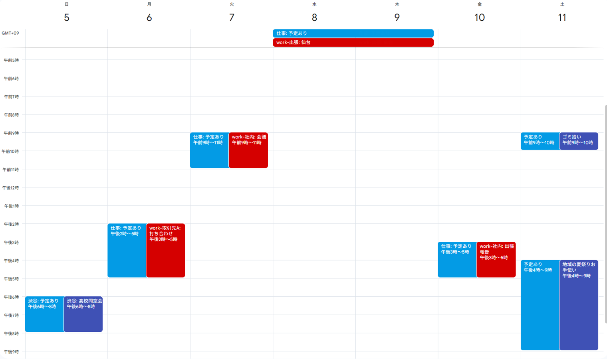


### 自動同期の設定
最後に，この同期処理を定期的に自動で実行するための「トリガー」を設定します.（推奨は10分おきです．）

1. 再度スクリプトエディタのタブに戻ります.

2. 左側メニューから「トリガー」（目覚まし時計のアイコン）をクリックします.
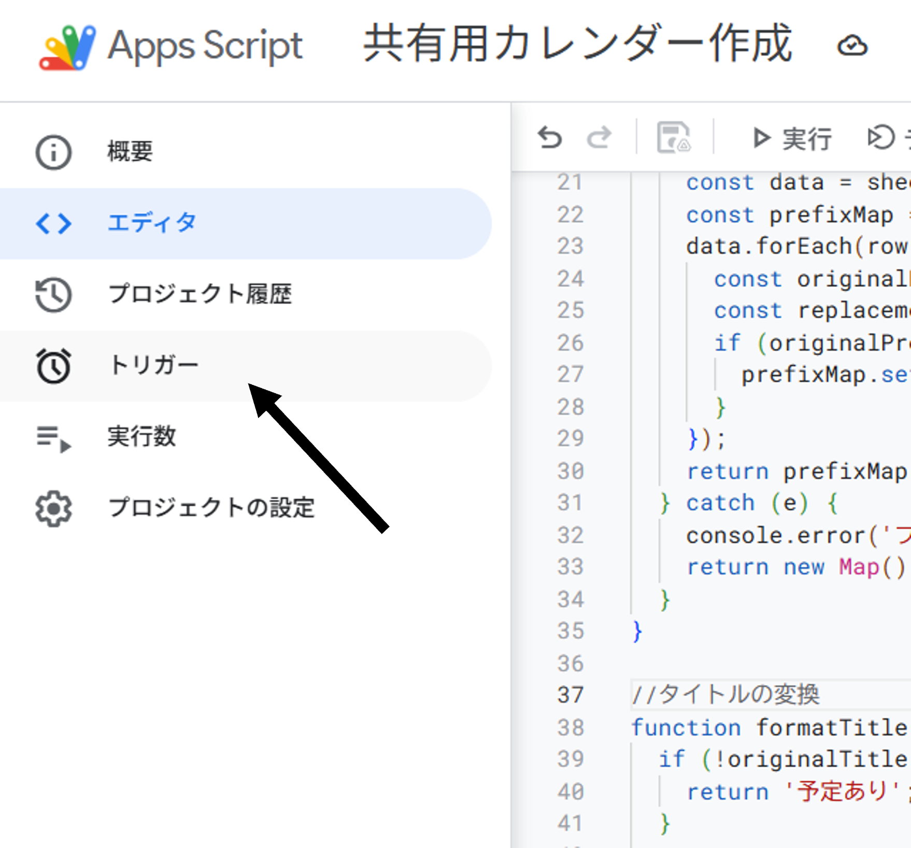

3. 右下の「トリガーを追加」ボタンをクリックし，以下のように設定します.
```
    実行する関数を選択: syncAllCalendars
    イベントのソースを選択: 時間主導型
    時間ベースのトリガーのタイプを選択: 分ベースのタイマー
    時間の間隔を選択（分）: 10分おき
```
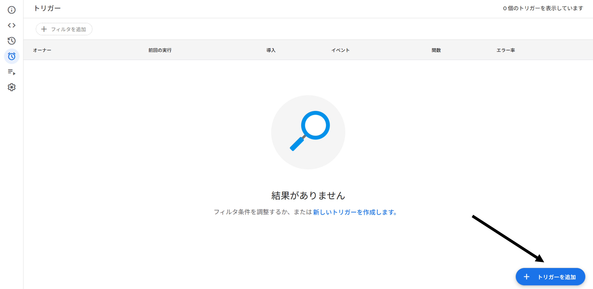
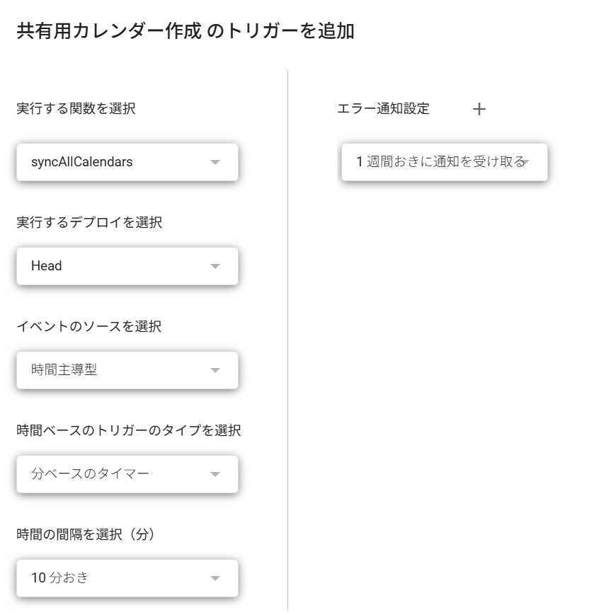

4. 「保存」ボタンをクリックします.

これで設定は完了です.スクリプトは指定した間隔で自動的に実行され，カレンダーの予定が集約されます.

## 集約したあと
集約されたカレンダーは，[共有設定](https://support.google.com/calendar/answer/37082?hl=ja)を行うことで他のユーザーと共有できます.共有したい相手に対して，Googleカレンダーの共有機能を使って共有してください.


## さいごに（活用例）
このツールを利用することで，複数のGoogleカレンダーに散らばった予定を一つにまとめ，効率的に共有することができます.実行時にエラーが起きる，定期実行されないなど何か問題が発生した場合はお気軽にご連絡ください．

[GitHubのリポジトリ](https://github.com/Syo-121/GoogleCalender_Integration/tree/main)もあります．Issue，PullRequest，Starお待ちしてます！

使い方は工夫次第でいろいろできると思いますので，ぜひ試して教えてほしいです！

先述しましたが，自分はコロンの前にはすべて「場所」を入れるようにして，どこに何時にいるのかが分かるようにしています．大学の授業は「大学-教室名: 授業名」といった形式で管理して，「大学-」で始まる予定はすべて「大学:予定あり」として共有カレンダーに表示されるようにすることで，教室名っていういらない情報を省きつつ，大学にいることだけは伝わるようにしています．

需要があればわかりやすいUIを追加したり，スプシ内で完結したり，アドオンにしたり...検討したいと思いますのでリアクションいただけると幸いです！

#### おまけ: Tags for Google Calendarの紹介
今回のツールと組み合わせて使うと便利なChrome拡張機能「[Tags for Google Calendar](https://chromewebstore.google.com/detail/tags-for-google-calendar/ncpjnjohbcgocheijdaafoidjnkpajka?hl=ja)」を紹介しておきます．

そもそも自分がこれを愛用していて，この情報を共有カレンダーに残したいっていう意図でこのツールを作り始めました．この拡張機能を使うと，Googleカレンダー上で予定のタイトルにタグを付けることができます．タイトル内のコロンの前までの部分が色付きで表示されるようになります（上の集約後の予定を見ていただければわかりやすいかと！）

今回開発したツールと相性いいので，（てかそうなるように作ってるので）ぜひ使ってみてください！

## 裏テーマ
最初にも書いた通り，今回はバイブコーディングのお試しもかねて開発してみました．普段自分がやってる組み込み開発ではバイブコーディングだけでは複雑なシステムのコードを書くのは難しいんですが，今回のようなシンプルなプロジェクトをGASのような有名なツールで開発すればバイブコーディングでもいけるんじゃないかと思ったんですよね．

結果，システム設計から主要な機能の殆どはgemini君が書いてくれました．ただ，一部エラーが出たところ（プレフィックスの設定関連）などはエラーコードを投げ続けるだけでは解決せず，自分でコードを読んで間違ってそうな部分を指摘して直してもらいました．(とはいえ間違ってる箇所とその理由を指摘したら完璧なものが帰ってきたのでやっぱりすごい)

やっぱり今の時点ではある程度のシステム理解と，言語，アルゴリズムに関する理解は必要だなぁというのが所感です．GASは触ったことあったのでデバッグできましたが，多分触ったこと無い言語でバイブコーディングだけで開発しろって言われたらきついなぁって感じです．ただやっぱり組み込み開発よりは明らかにAIが強いですね．

バイブコーディングについて先輩が本質情報を生やしてたので紹介しておきます


