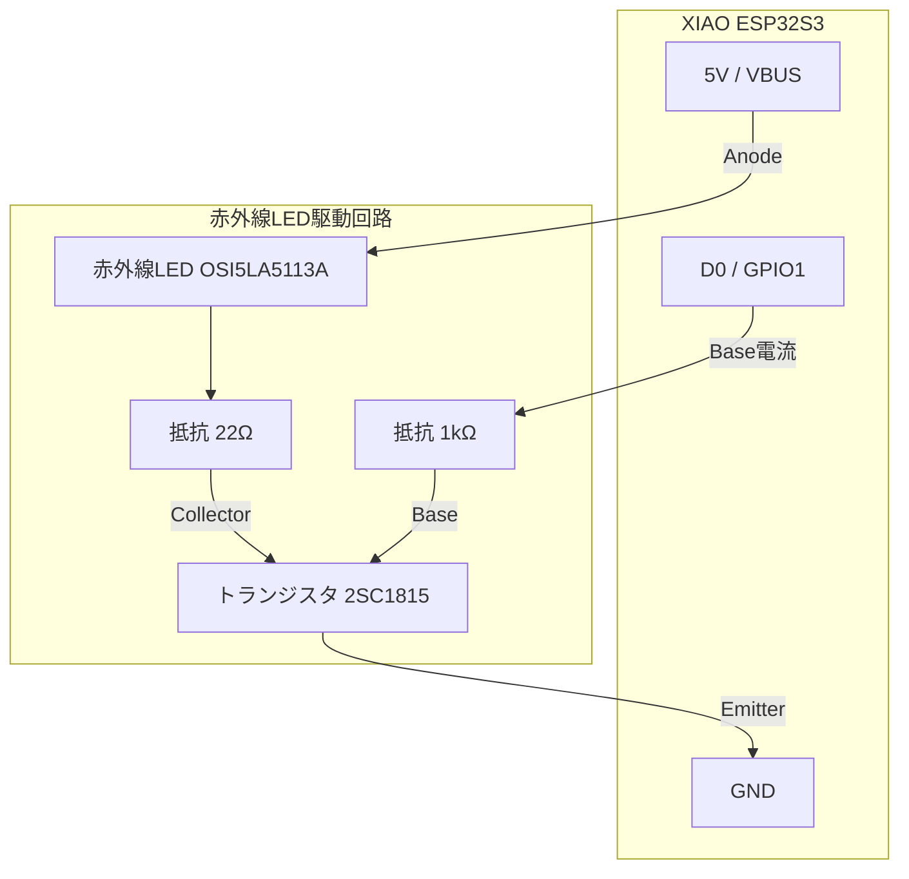

## はじめに
今回はESP32S3を使って，iOSの純正「ホーム」アプリから，エアコンやテレビなどの赤外線家電を操作できるスマートリモコンを自作しました．
ライブラリが充実していたため，当初想定していたよりもかなり簡単に作成できた上に，応用の幅が広いと感じたので共有します．


## 背景
高校時代の友人（非エンジニア）への誕生日プレゼントとして作成しました．
類似の市販品（Nature RemoやSwitchBotなど）は数多くありますが，友人の家は学生マンションで，そもそも操作したい家電がエアコンしかありません．市販品ではオーバースペックで費用がかさみます．

そこで今回は「赤外線製品をiOSのホームアプリから操作できる」という最低限の機能を，安価に実現することを目標にしました．（あと普通に作ってみたかった）

## 要求・要件定義
友人の要望と設置環境を考慮し，以下の要件を定義しました．

### 機能要件
- **iPhoneからエアコンを操作できること**
    - 電源ON/OFF
    - 冷暖房・自動の切り替え
    - 温度設定
  
※ 既存のリモコン信号の学習機能は今回は実装せず，プリセットされた信号の送信のみとしました．

### 非機能要件・制約
- **操作性（UX）**
    - iOS純正「ホーム」アプリで完結すること（専用アプリ開発はコスト高のため却下）
    - 初期設定が簡単であること（Wi-Fi設定等のためにシリアルモニタを開かせない）
- **ハードウェア**
    - エアコン直下のスペースに設置
    - USB電源駆動
- **コスト**
    - 市販品と同程度，あるいはそれより安く作成すること

## ハードウェア構成
部品は全て秋月電子で購入しました．ほとんど家に転がっていたものでできたので，実際にかかった費用はマイコン代くらいなもんでせいぜい1500円以下だと思います．

- **マイコン：XIAO ESP32S3** (約1,300円)
    - 当初は手持ちのESP32-C6を使う予定でしたが，使用する赤外線ライブラリ`IRremoteESP8266`がC6用のArduinoボードバージョンに未対応だったため（[GitHub issue](https://github.com/crankyoldgit/IRremoteESP8266/issues/2039)），急遽S3に変更しました．時間をかければC6でも動かせたかもしれませんが，今回は納期的に（ギリギリまでサボっていて）ギリギリだったので買い直しました．
- **赤外線LED：OSI5LA5113A**
    - 940nm（一般的なリモコン波長）のものであれば何でもOKだと思います．
- **その他回路部品**
    - トランジスタ (2SC1815)：LEDドライブ用
    - 抵抗 (22Ω, 10kΩ)
    - ユニバーサル基板 (片面Cタイプ)
    - 適当なボタン*2

回路は非常にシンプルで，GPIOピンからトランジスタを介して赤外線LEDをドライブするだけです．到達距離を稼ぐために，トランジスタを使って十分な電流を流すようにしています．
あと下の図には書いてないですが，ボタンは適当にプルアップしてます．
（はじめてmermaid記法を使ってみたんですが便利だけど難しいですね．AIに出力してもらえるメリットがおおきいかも）



> [!NOTE]
> **トランジスタのコレクタ電流の最大定格**
> 上の部品リストに22Ω抵抗が含まれていますが，実際には10Ω抵抗を使ったんですよね．
> ブログ書いてて怖くなって真面目に計算したんですが，5Vで供給，赤外線LEDの順方向電圧がだいたい1.35Vなので，トランジスタの飽和電圧を0.2Vとすると，LEDに流れる電流Iは
> I = (5V - 1.35V - 0.2V) / 10Ω = 365mA
> で2SC1815の最大コレクタ電流0.15Aを超えちゃうんですよねぇ
> 多分パルス信号だから耐えてるってことなんですかね．これでどれくらい出力変わるかわからないので真似する方は自分でブレボ等で試してからお願いします

## ソフトウェア構成と実装
今回の肝となるソフトウェア部分です．

### 使用ライブラリ
この2つのライブラリが偉すぎて，ほとんどの実装はこれらを組み合わせるだけで完了しました．使い方に癖もなく，ドキュメントも充実しているので非常に助かりました．今回はESP32S3かつArduino core2で動作させるために少し古いバージョンを使いました．

1.  **[IRremoteESP8266](https://github.com/crankyoldgit/IRremoteESP8266)**
    * 赤外線信号の送受信ライブラリ．PanasonicやMitsubishiなど主要メーカーのプロトコルが網羅されており，`acPanasonic.setTemp(24)` のように直感的に記述できます．
2.  **[HomeSpan](https://github.com/HomeSpan/HomeSpan)**
    * ESP32でHomeKitアクセサリを実装するためのライブラリ．
    * MFi認証不要でiOSデバイスと連携可能．
    * Wi-Fi認証情報のプロビジョニング機能が搭載されています．

### ソースコード
ソースコード全体は[GitHubリポジトリ](https://github.com/Syo-121/SmartRemoteController-with-ESP32-and-Homekit)を参照してください．(開発の最中に実際に使っていたリポジトリにはめっちゃ個人情報が含まれていたので，新規にリポジトリを作成しました．ごめんなさい)

## 工夫したポイント
コードの詳細な説明は割とするまでもなく，HomeSpanとIRremoteESP8266のドキュメントを読めば理解できると思うので，ここでは実装上で工夫したポイントを2点紹介します．

### 1. 照明（LightBulb）の「明るさ」でエアコンの機種を選択する
今回一番のポイントです．エアコンのプリセットの切り替えを実装したかったのですが，ハードを複雑にしたくなく，かつプレゼントだったのでシリアルモニタを開いたりコード書き換えもしたくなかったのでなんとか既存のHomeKit UIで実現できないかと考えました．
しかし，HomeKit標準のUIには「設定メニュー」のような自由なインターフェースがありません．そこで，照明用のアクセサリをダミーで用意し，その明るさをエアコンのモデル番号に対応させるという力技で実装しました．

```cpp
  struct ModelSelector : Service::LightBulb {
    SpanCharacteristic *power;
    SpanCharacteristic *level;
    ModelSelector() : Service::LightBulb() {
      power = new Characteristic::On(true, true);
      level = new Characteristic::Brightness(10, true); 
      level->setRange(10, NUM_MODELS * 10, 10);
    }
    int getModelIndex() {
      int val = level->getVal();
      if (val < 10) val = 10;
      if (val > NUM_MODELS * 10) val = NUM_MODELS * 10;
      return (val / 10) - 1;
    }
    boolean update() override { return true; }
  };
```

これにより，iPhoneのホームアプリ上で「AC Model Selector」という照明の明るさをスライダーで変更するだけで，
* 明るさ10% → 三菱（新モデル）
* 明るさ20% → 三菱（旧モデル）
* 明るさ30% → パナソニック

といったように，内部の送信プロトコルを切り替えられます．自宅のエアコンはPanasonic,友人の家は三菱だったので，デバッグにも非常に役立ちました．

### 2. エンジニアでなくても可能なWi-Fi設定 (HomeSpanの機能活用)
友人に渡す際，「PCに繋いでSSIDを書き込んで…」という手順は踏ませたくありません．
HomeSpanをアクセスポイントモードに切り替えることで，ESP32がWi-Fiアクセスポイントとして動作し，スマホから接続してWi-Fi設定を行えるようになります．

本来起動時にWifi接続に失敗した場合に自動でAPモードに切り替わるはずなのですが，僕の環境ではシリアルモニタを開いて明示的にアクセスポイントモードに移行させないと移行してくれませんでした．そこで物理ボタン（D2ピン）を押しながら起動することで，APモードへ移行する処理も追加しました．

Homespanに`processSerialCommand`という関数が用意されており，シリアルモニタで任意のキーを送信したときの処理をプログラム内から呼び出せます．

```cpp
  if (digitalRead(kForceApButtonPin) == LOW) {
    Serial.println("AP Mode Start!");
    
    // APモードへの移行を知らせる
    for(int i=0; i<3; i++) {
        digitalWrite(kStatusLedPin, LOW); delay(200);
        digitalWrite(kStatusLedPin, HIGH); delay(200);
    }
    
    // "A"を押したことにしてアクセスポイントモードへ
    homeSpan.processSerialCommand("A");
  }
```

これにより，友人が引っ越してWi-Fiが変わった場合でも，本体のボタンを押すだけで再設定が可能になります．ちなみにWiFiのリセットはファクトリーリセットをかけることで可能です．homespanではcontrolpinとして設定されたピンをLEDの点滅がとまるまで押し続けるとファクトリーリセットがかかります．(LEDはstatuspinとして設定されたピンに接続されたLEDです)

> [!NOTE]
> **実装時の注意点：Flash容量について**
> 今回はPanasonicとMitsubishiの2メーカーのみの実装だったのでデフォルト設定でも問題ありませんでしたが，`IRremoteESP8266`や`Homespan`は非常に多機能なため，欲張って多くのメーカーのヘッダファイルをincludeしたり，Bluetooth機能なども併用しようとすると，コンパイル後のバイナリサイズが一気に肥大化します．
>
> もし開発中に「Sketch too big」のようなエラーが出て書き込めなくなった場合は，Arduino IDEの **「Tools」>「Partition Scheme」** の設定を見直してみてください．
>
> デフォルト設定（Default 4MB with spiffsなど）ではOTA（無線書き込み）用の領域が確保されていますが，これを **「Huge APP (3MB No OTA/1MB SPIFFS)」** などに変更し，OTA機能を犠牲にすることでアプリケーション領域を最大化でき，容量不足を回避できます．
>
> （他のコードにHomeSpanを組み込むときにこれに直面しました...）

## 実際の挙動
アクセスポイントモードで起動し，espが出すwifiに接続するとこんな画面がでてきて，Wi-Fi設定ができます．


ドロップダウンメニューから選べるんでかなり簡単に設定できますし，設定後は自動で再起動して通常モードに入ります．
espは2.4GHz帯のみ対応なので，5GHz帯しかない環境では使えない点に注意してください．（ドロップダウンリストは当然2.4GHz帯のSSIDのみ表示されます）

あとはホームアプリから普通のハブと同じように追加できます．（QRコードで登録する場合は事前に用意しておかないといけませんが，ペアリングコードを手動で入力するだけもペアリングできます．）

登録後はこんな感じ，家電の名前はiPhone側から自由に変更できます．


あとはApple様が作った素晴らしいUIで操作するだけなので，操作性はかなりいいです．


iPhoneのショートカットアプリと連携できるので，かなり複雑なオートメーションも組めるはずです（試してないですが）
自作部分は最低限でも，かなり高機能なスマートリモコンができあがりました．

## まとめ
HomeSpanとIRremoteESP8266を組み合わせることで，実質2日ほどの開発期間で実用的なスマートリモコンを作成できました．
特にHomeSpanは，HomeKit対応機器を自作する際の「面倒な部分（ペアリング，Wi-Fi設定，UI構築）」をすべて肩代わりしてくれるため，ロジックの実装に集中できます．

今回は時間がないプレゼント用だったの最低限の機能でしたが，自分用にもう一台作って，温湿度センサーを追加してiPhoneにフィードバックとかやってみたいなと思っています．

ESP32S3と少しの部品でQOLが爆上がりするので，皆さんもぜひ試してみてください．
