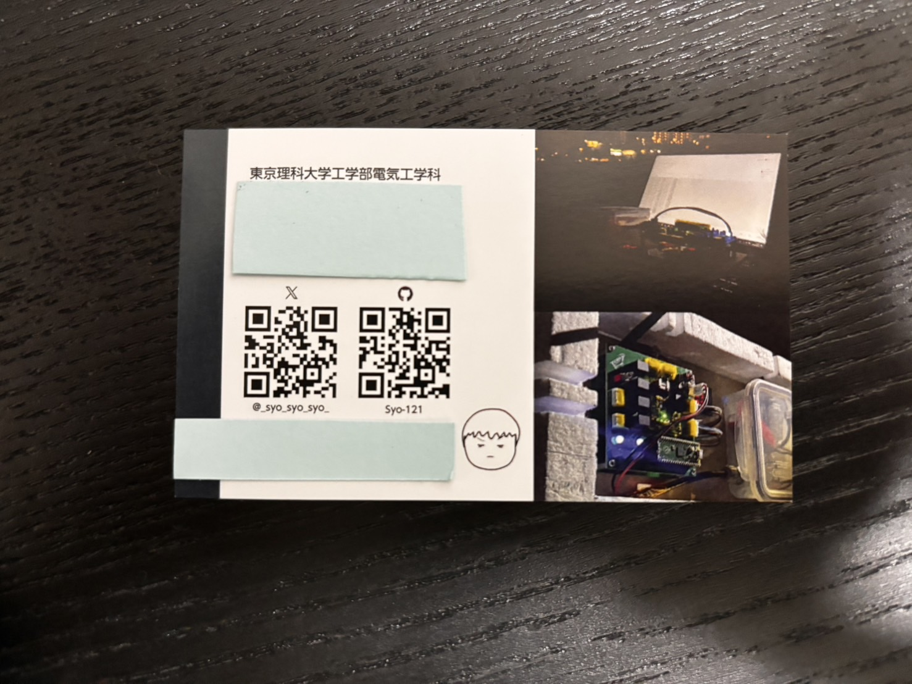
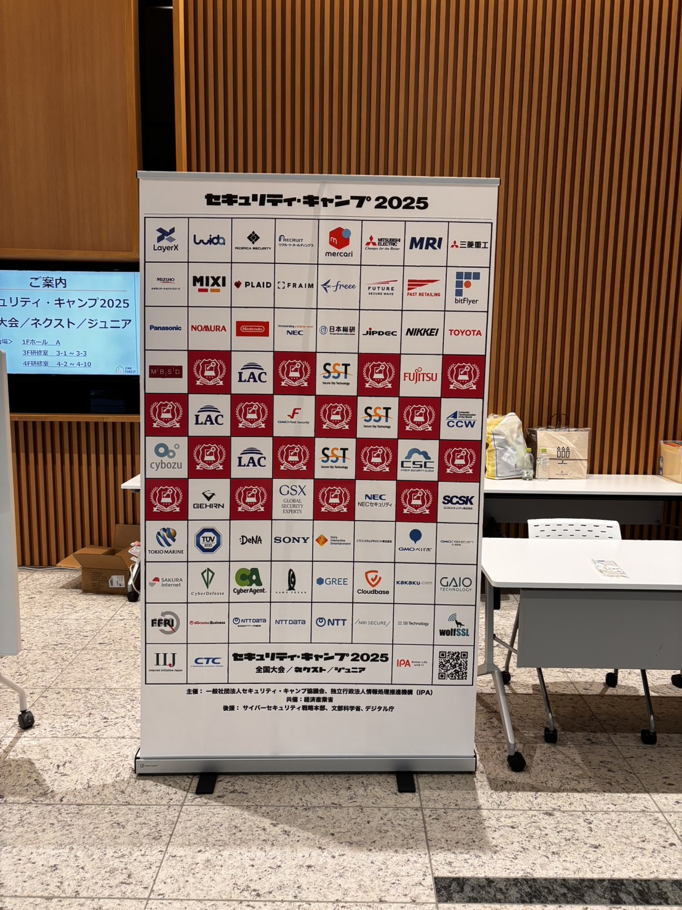

## はじめに
セキュリティ・キャンプ2025のX4（無線通信ハッキングゼミ）に参加させていただきました．自分なりに振り返って糧にしつつ，今後セキュリティ・キャンプへの参加を検討されている方の参考になればと思い，参加記を書きました．とにかくセキュリティ・キャンプに関する記憶をすべて書き連ねたので，余計な要素も多いかと思いますが，必要な部分だけピックアップして読んでいただければ幸いです．

> [!NOTE]
> 本記事の内容は参加したゼミの講師に事前にご確認いただいた上で公開しています

## 前日まで
キャンプ当日までにやったこと・考えたこと・準備したことなどをまとめます．
### 応募の経緯
もともとセキュリティ・キャンプの存在は知っていましたが，"セキュリティ"という言葉から勝手に高レイヤーを扱うエンジニアばかりが集まるイベントだと思い込んでいて，組み込み開発がメインの自分には関係ないイベントだと思っていました．先輩から"開発ゼミ"という自分が普段やっているようなレイヤーのゼミがあることを教えてもらった後も，レベルの高さのイメージから応募をためらっていました．

ただ今年になって就活について考えはじめ，"セキュリティ・キャンプ"という名のあるイベントに参加しておくのは悪くないと思い，ダメ元で応募してみました（後述しますが，結果的に"セキュリティ・キャンプの修了生"という肩書を得られたことよりも，中身自体が自分に与えた影響のほうが大きかったです）．

### ゼミ選び
ゼミ選びではまず，開発コースの中から説明文を見て自分の興味分野に近い下のコースに絞りました．

- X1 IoT機器のリバースエンジニアリングゼミ
- X2 ハードウェア魔改造ゼミ
- X3 センサーハッキングゼミ
- X4 無線通信ハッキングゼミ
- Y3 探査機自作ゼミ

この中で，事前課題の内容を見つつ，自分の興味と応募課題の内容を照らし合わせて第1希望から第3希望までを以下のように選びました．

1. X4 無線通信ハッキングゼミ
2. X2 ハードウェア魔改造ゼミ
3. X3 センサーハッキングゼミ

しかし実際には結局無線通信ハッキングゼミの課題を書いて息切れしてしまい，X2とX3にはエントリーしませんでした.

セキュキャンの課題はどのゼミも難易度が高い上に，考えさせられる内容が多く，LLMを使ったとしてもかなり時間がかかります．複数ゼミに応募した方が通りやすいんだろうなぁと思いつつ，無理せず第一希望のX4の課題のクオリティを高めることに注力しました．

### 応募課題
X4の応募課題は測定機器に関する知識や法令遵守のための電波法に関する知識を問う内容，データシートの読み取り力を問う内容など様々な課題がありました．回答の内容については気が向いたタイミングで別の記事にしようと思います．

自分の言葉で書きつつ，修了生の先輩にフィードバックをいただいたりしながらなんとか提出までこぎつけました．内容に個性を出せた感触がなく，正直合格の自信はありませんでしたが，なんとか選考を通過することができました．

### 事前学習
X4ゼミは事前の顔合わせ等はなく，必要なツールのインストールやゼミに必要な知識に関する動画を視聴することが事前学習として課されていました．そこまで内容としては重くなく，大学の期末試験やその他のタスクの合間に進めることができました．

### 荷物の準備
キャンプの荷造りは事務局からの案内や過去の参加者の方のブログ・ツイートなどを参考にしながら進めました．注意するべきなのは名刺です．キャンプ期間中は受講生の皆さんや講師の方々，企業の方など多くの方と名刺交換をする機会があるので，早めに準備しておくことをおすすめします．自分はラクスルのテンプレートを編集し，そのまま発注しました．ラクスルのデザイン機能は機能豊富で，やりたいデザインを実現することができました．そのまま発注できるのでデザインチェックも高速で，届くまでの時間も短かったです．
名前、所属、X (旧Twitter)やGitHubのIDに加えて、**製作物の写真**などを載せておくと、話が弾みやすく覚えてもらいやすいと思います。

<!-- TODO: 名刺の写真 -->

## キャンプ当日
いよいよキャンプ当日です．会場となるLINK FORESTに到着すると，すでに多くの受講生が集まっていました．元からの知り合いやゼミの顔合わせ等で仲良くなった人が多いのか，みんな楽しそうに談笑していて，焦りました．受付のための列に並んでいる最中は周りの人とほとんど話すことができませんでした...（事務的な話くらいはしましたが）．
ただ受付を終えて開講式の会場に入ると，席が指定されていて，その机の周りに座る人たちと名刺交換や自己紹介・世間話などをすることができ，少しずつ緊張がほぐれて，それ以降は周りの人と積極的に話せるようになりました．（おまけ程度に会話の始め方や話題の作り方のコツを最後にまとめました）

最初は1日ごとにまとめようと思っていましたが，開発ゼミの内容を日ごとにわけるのはめんどくさいので，講義ごとにまとめたいと思います．

### 共通講義
全国大会の専門コースやジュニア，ネクストの受講生の方たちと一緒に受ける講義がいくつかあります．コース分けやゼミ分けに全く関係なくランダムで4人班が組まれていて，その班で同じ机に座って講義を受けたり，グループワークをしたり，議論をしたりしました．
セキュキャンが始まって最初に話した方たちで，とてもいい方ばかりでした！

共通講義では講義を受けながらリアルタイムで自分の意見を話すための実況チャンネルがDiscordに用意されていました．自分が考えたこととDiscordに書かれたことを見比べたり，自分には無い視点で講義を捉えている人の意見に触れたりできて，とても面白かったです．

### K2 -物語の力で情報セキュリティを発信するということ-～アニメ「こうしす！」を例に～
開講式の後は，セキュリティ関係の自作アニメ「こうしす！」の作者である井二かけるさんによる講義がありました．講義の中では「こうしす！」を例に物語など一般の人ともわかりやすい形で情報セキュリティについて発信することの面白さや重要性，難しさなどについてお話しされていました．

技術に関して，エンジニアでない一般の人が知っておくべき知識はそれほど多くないと思いがちですし思われがちです．しかしセキュリティという側面から見ると，一般の，技術を使う側の人間が意識をもって対策しないと，開発側の人間が奮闘するだけではどうにもならないことがあります．

（セキュリティ・キャンプで受講生同士で話すのがとても楽しいように）知識を持ったエンジニア同士で話すのは楽しいので，なかなか一般の人に向けて発信しようと考えません．この講義はそのような発信の重要性を再認識させてくれるものであったと共に，その発信の難しさや面白さを教えてくれるものでした．

なかなか井二さんのように大きな行動に移すのは難しいですが，エンジニアでない人に技術について話すことを怖がらず（積極的にしすぎて相手を困らせない程度に）話す意識を持とうと思いました．

### K1 法律と倫理
セキュリティ・キャンプでは学んだ技術を正しく使うために，毎年法律や倫理の講義があるようです．この講義では現職の検事さんに来ていただき，「法律」そのものに関する基本的な知識や，技術者として知っておくべき法律の知識，倫理観などについてお話しいただきました．

「法律」，「倫理」という言葉から堅苦しくて難しい印象を受け，敬遠してしまっていましたが，検事の方の話が上手く，最後まで楽しく聞くことができました．

講義の後半では実際に「悪いことをしないようにどうするか」，「巻き込まれないためにどうするか」など具体的な心構え・手段についてDiscordのチャットで受講生が意見を出しながら全体で考える時間がありました．

普通に使えば世の中の役に立つ技術，知識でも使い方を間違えるだけで簡単に悪用できてしまうことを念頭において，技術を学び使っていきたいと思いました．実際後述するゼミの活動の中でそれを深く実感しました．（詳しくはゼミの活動の中で触れます）

### K3 先端研究と社会への届け方
2日目の夜にあったこの講義では，研究するだけではなく，それを社会に届けることの重要性について，企業での開発と研究を両立されている講師の方からお話を伺いました．実際に研究を社会に届けるまでの一連の流れを経験している方のお話はとても具体的で参考になりました．

### T1 海外のセキュリティコミュニティに飛び込む：その第一歩から最前線まで
4日目の夜のこの講義では，実際に海外のセキュリティコミュニティの最前線で活躍されている中島明日香さんから，実際に中島さんがセキュリティ・キャンプを修了してから今にいたるまでの経験談を元に，セキュリティキャンプでの経験を無駄にせず活躍する人材になるための心構えについてお話を伺いました．

セキュリティ系のエンジニアになる可能性は低いかなぁと思いながら聞き始めたので，あんまり参考にならないかもなぁと思っていたのですが実際にはセキュリティ系のエンジニアに限らず，エンジニアとして自分のキャリアを磨くために必要な心構えや行動についてお話しいただき，とても参考になりました．

特に「自分が周囲に提供できる価値」を意識するというお話の中で，自分に周りと比べて尖った専門分野がなくても，見方を変えれば自分にしか提供できない価値があることに気づかされました．「日本人であること」「若手であること」など当たり前だと思っていた属性でも，それを活かして提供できる価値があるということは，今後の自分のキャリアを考える上でとても参考になりました．

## 開発ゼミの話
無線通信ハッキングゼミでは，電波法の説明・理解から始まり，SDRの内部構造，高周波回路の扱い，サンプリングや無線工学の基礎から始まり，最終的には無線通信レイヤーにおける攻撃やその対策手法などについて講義を受けた後，実際に無線通信の解析や擬似的な攻撃を行ってみるという内容でした．

基礎の基礎から始まり，３日間で実際にSDRを用いて無線通信の解析や攻撃を行うところまで行くので，かなり盛りだくさんで詰め込まれた内容でした．

講義の内容について書いても仕方ないと思うので，ここでは実習部分についてのみ書こうと思います．

> [!NOTE]
> 実習は技適マークがついている既製品以外の既製品はすべて同軸ケーブルでつないで有線で通信し，外部に電波が出ないように電波法を遵守して行いました．

### ジャミング・リプレイ攻撃の実習
市販のリモコンの信号をSDRを用いてジャミングして妨害してみたり，取得した信号を反復して送信することでリプレイ攻撃を行ってみたりしました．

市販のリモコンということで搬送周波数がわかりません．おおよその搬送周波数がわからなければ，ジャミングすることも電波を記録してリプレイ攻撃することもできません．スペクトラム・アナライザを用いて周波数をスイープして確認する方法も考えられますが，空間上には多くの電波が飛び交っており，どれがリモコンの周波数か特定するのは容易なことではありません．今回は，送受信のハードウェアの実機がある前提で周波数のあたりをつけてみました．（その手順を講師の方に説明いただきました）

リモコンの中身を分解して，回路の中から発振器が見つかればその型番を調べることで周波数を特定することができます．また送信側で特定できないときは受信機側を分解してみることで，特定の周波数に使われるような部品が入ってることがあり，そちらから特定できることもあるようです．今回は前者で特定することができました．

周波数がある程度特定できたら，SDRでその周波数を受信してみて，実際にリモコンのボタンを押してみます．するとスペクトラム・アナライザの画面上で，その周波数にピークが立つことがわかります．

この周波数でジャミングやリプレイ攻撃を行うことで，実際にリモコンの信号を妨害したり，リプレイ攻撃を行ったりすることができました．

### 復調の実習
講師の方が自作したトランシーバの信号をSDRで受信し，復調して中身を解析する実習を行いました．信号は搬送周波数のみがわかっている状態で，復調方式等は未知な状態で行いました．CTF形式で，1つの信号を復調するとトランシーバから新たな信号を出すためのコードと搬送周波数がわかるようになっていました．

課題の詳細等は来年以降へのネタバレになってしまうので割愛しますが，ゼミの終わりまでに4つの信号すべてを復調して中身を解析することができました．

### 3日間のゼミを通して
無線通信ハッキングゼミはセキュリティ・キャンプの中でも最も低いレイヤーのセキュリティを扱うゼミだと思います．物理層をネチネチといじくり回した3日間で，通信の仕組みの根本となる部分にほんの少しの時間でしたが触れることができてとても楽しく，いい経験になりました．

世の中には簡単に通信をするためのICもあれば，変調・復調を簡単に行ってくれるツールもあります．それらを使えば誰でも簡単に通信できます．実際僕も無線通信モジュールを使って通信したことは何度もあります．

しかし，モジュールやツールがどのような仕組みで動いているのかを理解しすることは重要です．内部の仕組みを理解していなければ，モジュールやツールを正しく使うこともできなければ，トラブルシューティングもできません．ましてや，内部の仕組みがわからないのに脆弱性を見つけたり，それを対策するようなことができるはずがありません．今回の復調の実習では，復調にツールを用いず，すべてPythonを用いて自作しました．この経験を活かして，本質を理解してツールを作る側になりたいと思いました．

これらの内容に加えて，実際にゼミの実習を通して感じた，傍受・復調の難しさ，ジャミング・リプレイ攻撃の簡単さとそれを対策することの重要性を含めて，成果発表としてXの4つのゼミの中で発表しました．

光栄なことにXトラックの代表に選んでいただき，5日目に全体の成果発表会で発表させていただきました．

## 成果発表会
5日目の夜には全体での成果発表会がありました．専門コース，開発コースの各トラック，ジュニア，ネクストの代表やSC-NOC（Network Operation Center）の方々が5日間の成果を発表しました．



自分はXトラックの代表として，無線通信ハッキングゼミでの活動内容を発表しました．代表となったことは前日の夜にDiscordで知らされ，Xトラック内で使用したスライドを元に約10分間発表を行いました．使用したスライドを載せておきます．

他のコースの代表の方々の発表もとても面白かったです．専門コースやネクストの発表は自分には難しい内容も多かったですが，わかりやすくコースの目的やそこから学んだことを説明されていて，勉強になりました．ジュニアの内容は，中学生とは思えないほどレベルが高く，とても刺激を受けました．それぞれの内容は各コースの方が書かれている参加記等を参照していただければと思います．



## その他
共通講義や専門講義以外にも，様々なイベントがありました．
### G グループワーク
1日目の夕食後には6日間のセキュリティ・キャンプを通しての目標（定量的に評価できるものに限る）を考えるグループワークがありました．自分でいくつか案を考えた後，先述の班のメンバーや他の班の人たちと話し合いながら自分なりに3つの目標を立てました．

1. 毎日500字以上日記を書く
2. 知らないツールや資料を10個以上知る
3. 5分悩んでわからないことは周りに相談する

グループワークの中では，他の人の目標を聞くタイミングで名刺を交換して普段の活動について歓談しながら，色々な人が考えた目標を聞くことができました．今考えると6日間の中で一番密度濃くたくさんの人と話したのはこの時間だったかもしれません．

その人が立てた目標を聞くことで，少しですがその人の考え方や価値観が見えてきて，仲良くなるきっかけになりました．

### LT大会
2日目と4日目の夜にはLT大会がありました．2日目は全体で，4日目は複数の部屋に分かれて自分が興味ある部屋に行く形式でした．自分はキャンプ当日まで発表する予定はなかったのですが，2日目のLT大会で刺激を受けて，その場で申し込み，4日目に「鳥人間コンテストに出た話」というタイトルでLTをしました．

セキュキャンの本筋とは関係ないので，内容については割愛しますが（興味ある方は個別でご連絡ください）,複数の部屋に分かれていたのにも関わらず多くの受講生の方やチューターの方が聞きに来てくださり，面白かったと言っていただけてとても嬉しかったです．

発表前はセキュキャンの参加者の興味範囲とずれているのではないかと気がして不安でしたが，セキュキャンの参加者は好奇心旺盛でどんな話でも興味を持って聞いてくれます．
発表によって新たなつながりができたり，興味を持ってくれた人が話しかけてくれたりして，今では勇気をだして発表してよかったと思っています．

内容に自身がなくても，積極的に発表してみることをおすすめします！

### BOF
3日目の夜にはBOF（Birds of a Feather）がありました．BOFは受講生やチューターが自分でテーマを決めて，そのテーマに興味ある人たちが集まって話す会です．自分はセキュキャンの応募課題について語る会や宇宙開発について語る会に参加しました．前者では自分が応募していない（課題の内容も見ていない）ゼミの課題についてどんなことを考えて書いたのかを聞くことができました．後者では宇宙に限らず，電子工作が好きな人が集まって普段のお互いの活動について話したり，後半では講師のsksatさんから衛星開発のお話を伺いました．

どちらの会もその日初めて話すような人と話すことができて，それ以降の日程でもその方たちと仲良くすることができて，とてもいいきっかけになりました．

## 企業イベント・懇親会
5日目の閉講式の後には企業イベントや企業の方と話せる懇親会がありました．セキュリティ分野の企業についてあまり詳しく調べたことがなかったので，大変参考になりました．修了生のエンジニアの方々も多くいらっしゃっていて，セキュキャンを修了したあとのキャリア形成の方法についても色々伺うことができました．

懇親会では企業の方はもちろんのこと，受講生のみなさんとちゃんと話せる最後の機会だったこともあって，色々なことを話しているうちに時間があっという間にたっていきました．この懇親会で初めて話す受講生の方もいて，興味分野がものすごく近く，話が弾んでとても楽しかったです．

## 完走した感想
まずはグループワークで立てた目標を振り返ってみようと思います．

1. 毎日500字以上日記を書く
->  字数についてはこだわっていませんでしたが，それぞれの日に学んだこと，思ったこと，感じたことを毎夜まとめることはできました．
2. 知らないツールや資料を10個以上知る
->  10個どころではなくたくさんのツールを知ることができました．特に専門コースで扱われたような高レイヤーのツールはほとんどが初めて知るものでした．専門コースのみなさんは食事の時などに質問すると丁寧に教えてくださり，色々勉強になりました．
3. 5分悩んでわからないことは周りに相談する
->  ゼミのCTFなど自分の力で解決することが大切な場面が多く，相談する機会があまりありませんでした．ただ，セキュリティ・キャンプが終わるときに疑問に思ったままになることがないよう，講師の方に積極的に質問することは心がけました．

6日間のセキュリティ・キャンプで得られたものはあまりにも多かったです．たくさんの面白い受講生，チューター，講師やプロデューサーの方々，企業の方々との出会い，ハードウェアセキュリティという新たな分野への興味，技術を正しく使うための法律や倫理観，技術を社会に届けることの重要性，エンジニアとしてのキャリア形成の方法などなど...数え上げたらキリがありません．

とにかく確実にいえるのは，この6日間がただただ知識を得るための6日間ではなく，次へとつながる色々なものを得られた6日間だったということです．この素晴らしいイベントに参加させていただいたことを感謝し，得られた経験や刺激を無駄にせず，今後の自分の人生に活かしていきたいと思います．

6日間ありがとうございました！



## コラム : セキュキャンで初対面の人と話すコツ
セキュリティ・キャンプでは食事のときやグループワーク，共通講義の休憩時間など，初対面の人と話す機会がたくさんあります．自分は初対面の人と話題を作って話すのがあまり得意ではないのですが，少しでも多くの人と話して仲良くなりたいと思い，色々試行錯誤しながら以下のようなことを意識すると話しやすかったです．

セキュキャンはほぼ全員が初対面なので，初対面で話しかけて煙たがられることはまずありません．むしろいろいろな人と話したいと思っている人が多いはずです．まずは何も考えず「話したことないですよね？名刺交換させてもらえませんか？？」とラフに話しかけることが大切だと思います．ラフに話しかければ相手もラフに話してくれます．

話しかけた後は，以下のような話題を振ると話が続きやすいです．

- どのゼミ/コースに参加しているか
-> とにかくここから話しましょう．自分と違うコース・ゼミであればそのゼミの話やどうしてそのゼミを選んだかなどの話に必ずなりますし，何も考えなくても話が進みます．

- 普段何をしているか
-> セキュキャンに参加しているような人は普段からサークルや趣味，研究に熱心に取り組んでいる人がほとんどなのでこの話題を振れば基本相手が無限に喋ってくれます．話の内容が自分の普段の活動と被っていれば当然話が進みますし，被っていなかったとしたら積極的に相手に質問して面白い話を引き出しましょう．セキュキャンでは「隙あらば自語り」はむしろ歓迎されると思います（やりすぎは気を付けて）

- セキュキャンでの生活の話
-> セキュキャンは非日常なので，朝起きるの辛いよね～とか，昨日の夜の講義はこうだったよとか，セキュキャンの生活に関する話題はいくらでも出てきます．そこから普段の生活や活動，趣味の話にひょんなことからつながったりします．

当たり前のことに聞こえるかもしれませんが，興味分野が概ね被っている人が参加しているわけで，きっかけさえ掴めば基本的には仲良く慣れます．自分も話した人数がものすごく多い方ではないですが，自分のペースで話しつづけて多くの友達を作ることができました．

頑張って一生物の友達/仲間を作りましょう！
